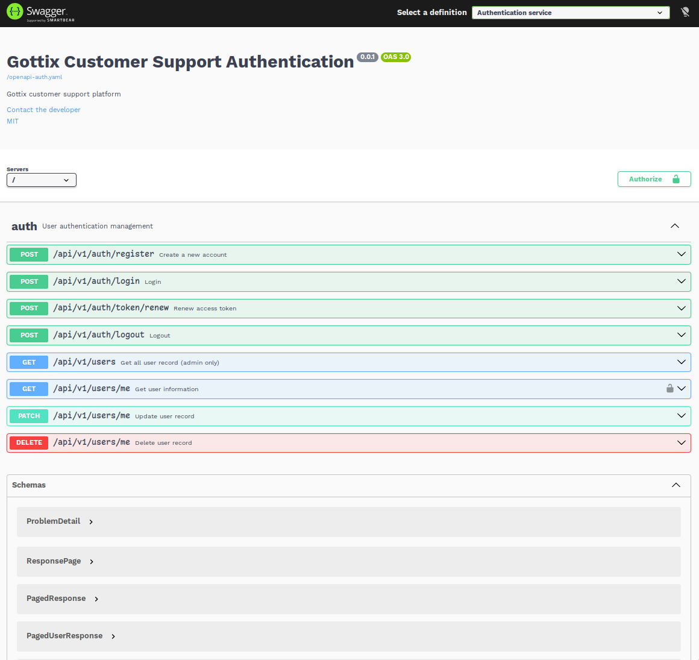
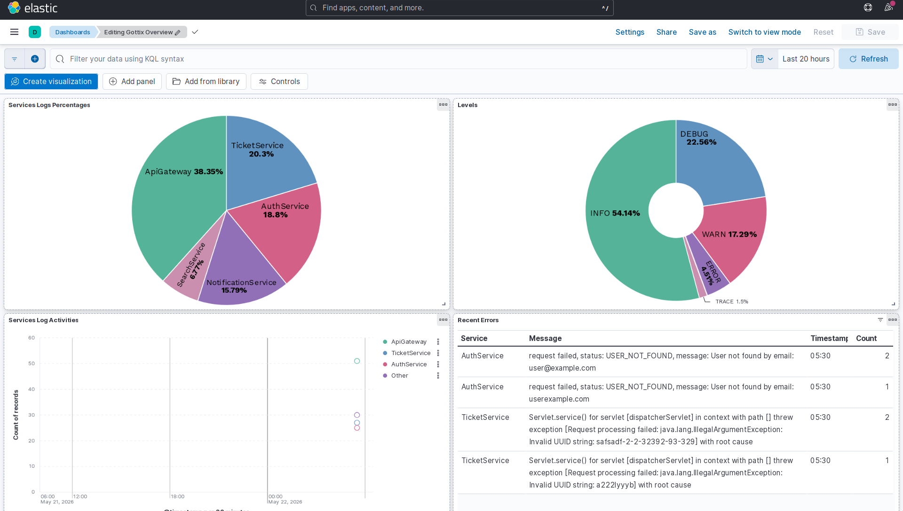

# Introduction

Gottix is a support ticket management application built with a microservices
architecture, this is my practice project for exploring the microservices
architecture, async communication, and high performance search indexing.

## Getting Started

### Prerequisites

- Docker and Docker Compose
- Java 17+
- Maven

### Installation & Launch

**1. Clone the repository:**

```bash
git clone git@github.com:PeasfulTown/gottix
cd gottix
```

**2. Build the project:**

```bash
mvn clean package -DskipTests
```

**3. Build and run containers:**

```bash
docker compose up --build -d
```

Then in your browser, access `http://localhost:8080/swagger-ui.html` to see the
Swagger UI, switch between services using the dropdown menu on the top-right of
the Swagger UI page. All microservices endpoints are protected and need
authorization, so start by registering a new account and copy the `accessToken`
from the response body, click on the **Authorize** button with the lock icon and
paste the `accessToken`.



## Infrastructure Services

- API Gateway: Provides a single entry point for all microservices, handles JWT
  decoding and header forwarding, exposes Swagger UI for API testing
- Eureka Discovery: Handles service registration so microservices can find each
  other
- Config Server: Provides centralized configuration file management for all
  services

Running on docker container using docker compose.

## Services

- Authentication: Manages user identity, credentials, basic profile information
- Ticket: Core business logic for ticket creation, assignments and basic
  workflow
- Search: Indexes ticket data into Elasticsearch for fast fulltext querying
  across ticket title, description, ticket comments, filter by status, priority,
  etc.
- Notification: Listen for ticket modification events and store as user
  notifications

## Tech Stack

| Category              | Technology                                        |
| --------------------- | ------------------------------------------------- |
| Framework             | Spring Boot 3.5.11                                |
| API Gateway           | Spring Cloud Gateway                              |
| Service Communication | RabbitMQ (async)                                  |
| Service Discovery     | Spring Cloud Netflix Eureka                       |
| Authentication        | JWT (JJWT), Spring Security                       |
| Database              | PostgreSQL 16, Elasticsearch 8, Redis (blocklist) |
| Database Migrations   | Flyway                                            |
| ORM                   | Spring Data JPA / Hibernate                       |
| API Documentation     | SpringDoc OpenAPI (Swagger UI)                    |
| Containerization      | Docker, Docker Compose                            |
| Testing               | JUnit 5, Testcontainers, WireMock                 |
| Build Tool            | Maven                                             |

## Kibana Dashboard

ELK is implemented for centralized logging and observability, I've created a
simple Kibana Dashboard [dash.ndjson](./dash.ndjson) that can be imported.

The dash shows a pie graph of percentages of logs coming from each microservices
and the API Gateway, percentages of logs grouped by level (TRACE, INFO, WARN,
ERROR), log activities from each microservices the last 30 minutes, and a table
of recent errors with their error messages.



